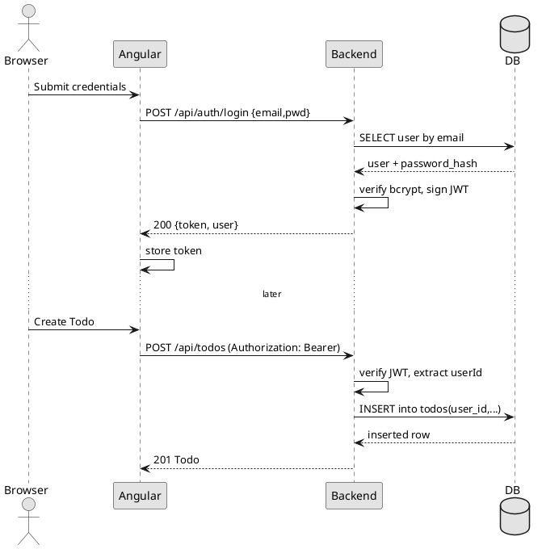
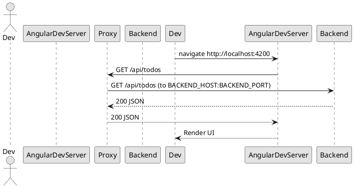

# Design — Scala + Angular Cats Template

## Architecture Overview
- Single SBT project (Scala 3) with Angular UI inside `ui/`.
- Backend: http4s + cats-effect, Circe, Doobie + HikariCP, Flyway, PureConfig, log4cats (JSON via Logback), JWT auth.
- Frontend: Angular 18, RxJS 7, dev proxy to backend using `BACKEND_HOST`/`BACKEND_PORT`.
- Build/Deploy: Node 22 LTS for UI, sbt-native-packager `stage` builds UI then stages backend; deploy to Heroku; Postgres as DB.
- Static assets: Angular prod build emitted to `src/main/resources/static` and served by backend in prod.

## Components
- Backend
  - HTTP API (http4s): routes under `/api`, middlewares (CORS in dev, request-id, request/response logging, error handling).
  - Auth: JWT-based (pdi-jwt), bcrypt password hashing; auth middleware injects `UserCtx`.
  - Services: pure algebras (`F[_]`) for Todos and Users; implement business rules and validation.
  - Persistence: Doobie repositories interpret algebras, run parametrized SQL; schema/migrations via Flyway.
  - Config: PureConfig-backed case classes (ports, DB, JWT, CORS, log level, env mode).
  - Observability: log4cats with JSON Logback encoder, MDC for requestId / userId; optional natchez wiring later.
  - Static/SPA: http4s static file service and SPA fallback for non-`/api` paths.
- Frontend
  - Angular modules: Auth, Todos, Shared, Core (services, interceptors, guards).
  - Interceptors: Attach `Authorization: Bearer <jwt>` when present; handle 401 → redirect to login.
  - Components: Login, Signup, TodoList, TodoForm, Header.
  - Services: ApiClient (Auth, Todos), State services (lightweight RxJS subjects or NgRx optional later).
  - Dev proxy: `ui/src/proxy.conf.js` forwards `/api` to backend and falls back to `index.html` for SPA routes.
- Build & Tooling
  - sbt `stage`: runs `npm --prefix ui ci && npm --prefix ui run build:prod`, then stages backend (native-packager) for Heroku.
  - Test: munit + munit-cats-effect, TestContainers Postgres for integration tests.

## Data Models
- User
  - Fields: `id: UUID`, `email: String` (unique), `password_hash: String`, `created_at: Instant`, `updated_at: Instant`.
  - Constraints: unique(email); strong password policy validated in service.
- Todo
  - Fields: `id: UUID`, `user_id: UUID` (FK → users.id), `title: String`, `description: Option[String]`, `due_date: Option[Instant]`, `completed: Boolean` (default false), `created_at: Instant`, `updated_at: Instant`.
  - Indexes: `(user_id)`, `(user_id, completed)`, `(user_id, due_date)`.
- JWT Claims
  - `sub`: user UUID; `iat`, `exp`; optional `iss`.

Example entities
- User (redacted): `{ "id": "UUID", "email": "e@example.com", "createdAt": "2025-10-30T12:00:00Z" }`
- Todo: `{ "id":"UUID","title":"Buy milk","completed":false,"dueDate":null,"createdAt":"2025-10-30T12:00:00Z" }`

## API Endpoints
- Auth
  - POST `/api/auth/signup` → 201 `{ id, email }`
  - POST `/api/auth/login` → 200 `{ token, user: { id, email } }`
  - GET `/api/auth/me` (Bearer) → 200 `{ id, email }`
- Todos (Bearer required)
  - POST `/api/todos` body `{ title, description?, dueDate? }` → 201 Todo
  - GET `/api/todos?limit&offset&status?` (`status`: `all|open|done`) → 200 `{ items: [Todo], total, limit, offset }`
  - GET `/api/todos/{id}` → 200 Todo | 404
  - PUT `/api/todos/{id}` body `{ title?, description?, dueDate?, completed? }` → 200 Todo | 404
  - PATCH `/api/todos/{id}/toggle` → 200 Todo | 404
  - DELETE `/api/todos/{id}` → 204 | 404
- Ops
  - GET `/health` → 200 `{ status: "ok" }`
  - GET `/ready` → 200 `{ db: "ok", migrations: "ok" }` or `503`

Error format
- `{ "error": { "code": "string", "message": "human readable", "details": { ... } } }`

## Sequence Diagrams (PlantUML)

Login and subsequent authorized request

Angular dev proxy to backend

## Deployment
- Local Dev
  - Run backend at `HTTP_PORT=8080`; `ANGULAR_MODE=dev`; run `npm --prefix ui start` or SBT hook to auto-start Angular.
  - CORS enabled for `http://localhost:4200` only; JSON logs at INFO (pretty console optional).
- Production (Heroku)
  - Multi-buildpack: `heroku/nodejs` then `heroku/java`.
  - `sbt stage`:
    1) `npm --prefix ui ci && npm --prefix ui run build:prod` → outputs to `src/main/resources/static`.
    2) Stage backend via native-packager.
  - Procfile: `web: target/universal/stage/bin/<app> -Dhttp.port=$PORT`.
  - DB: use `DATABASE_URL` (SSL), run Flyway on start; health and readiness endpoints used by checks.

## Data Flow
- Request entry → http4s middlewares (request-id, auth, logging, CORS in dev) → routes.
- Routes delegate to services (pure algebras) → repositories (Doobie programs) → Postgres.
- Responses encoded via Circe → logging with context → returned to client.
- In prod, static assets served by backend; in dev, Angular dev server serves assets and proxies `/api`.

## Configuration Summary
- Ports: backend `8080`, Angular dev `4200`.
- Env vars: `BACKEND_HOST`, `BACKEND_PORT`, `HTTP_PORT`, `ANGULAR_MODE`, `ANGULAR_PORT`, `DATABASE_URL`, `DB_USER`, `DB_PASSWORD`, `DB_SCHEMA`, `DB_MAX_POOL_SIZE`, `DB_MIN_IDLE`, `DB_CONNECTION_TIMEOUT`, `JWT_SECRET`, `JWT_TTL`, `TODO_DEFAULT_PAGE_SIZE`, `TODO_MAX_PAGE_SIZE`, `LOG_LEVEL`, `TRACING_ENABLED`.

## Directory Structure (high level)
- Root SBT project: `build.sbt`, `project/`.
- Backend: `src/main/scala`, `src/main/resources` (Flyway migrations, Logback config, static UI in prod), `src/test`.
- Frontend: `ui/` with `angular.json`, `package.json`, `src/proxy.conf.js`.

## Non-Functional Notes
- Concurrency: cats-effect IO runtime; avoid blocking; Doobie on default fixed blocker for JDBC.
- Logging: single-line JSON; include `requestId`, `userId` when available; redact secrets.
- Testing: unit + integration with TestContainers Postgres; seeds/migrations applied before tests.
- Extensibility: repositories behind algebras → swap to Skunk possible (see docs/tech.md).
